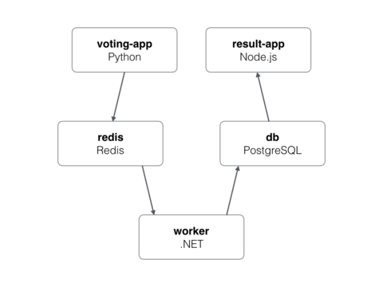

# Voting App - Docker Compose :whale:

Get the project from the [repository](https://www.github.com/RedaLegzali)



```bash
├── docker-compose.yml
├── result
│   ├── Dockerfile
│   ├── dotnet
│   ├── package.json
│   ├── package-lock.json
│   ├── server.js
│   ├── tests
│   └── views
├── vote
│   ├── app.py
│   ├── app.pyc
│   ├── Dockerfile
│   ├── dotnet
│   ├── requirements.txt
│   ├── static
│   └── templates
└── worker
    ├── Dockerfile
    ├── dotnet
    ├── pom.xml
    ├── src
    └── target
```

---

The application contains 3 top directories which all contain a specific Dockerfile. <br>

Your job is to complete the docker-compose file and use those Dockerfiles to build the images and run them. <br>

Of course the docker-compose must also contains the redis and postgres images. <br>

Just as in any project refer to [Docker Hub](https://hub.docker.com) to search for the images documentation and get the required environment variables.

You must respect the order of containers:

- Start the vote container only if the redis container is started.
- Start the result container only if the postgres container is running.
- Start the worker container only if the redis and postgres containers are runnning.

N.B: 
- The application has been tested with these redis and postgres image tags:
    - redis:5.0-alpine3.10
    - postgres:9.4
- Don't change the services names ( redis - db - worker - result - vote ) in docker-compose, the applications use these dns names to reach each other.